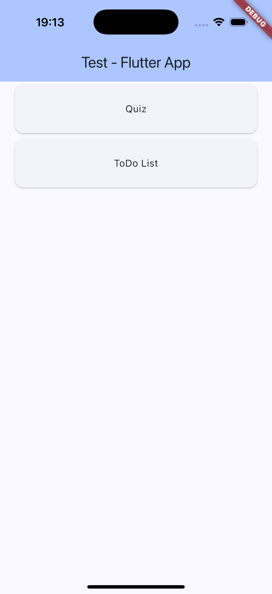

# Application with 2 features: Pokemon Quiz and To Do List

## Objective
The idea of this project was to implement a simple application on Flutter. I got one MBA activity where the main objective was to create a software and rate pair programming during development. So I tried to begin a new technology that I always liked.

## Overview
### Main screen:

### Pokemon quiz screen

### To Do List screen

For help getting started with Flutter development, view the
[online documentation](https://docs.flutter.dev/), which offers tutorials,
samples, guidance on mobile development, and a full API reference.
# flutter_application_01
